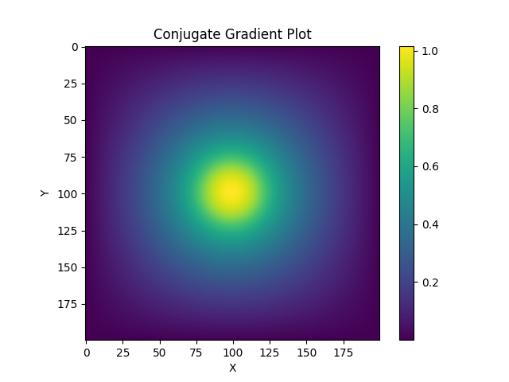
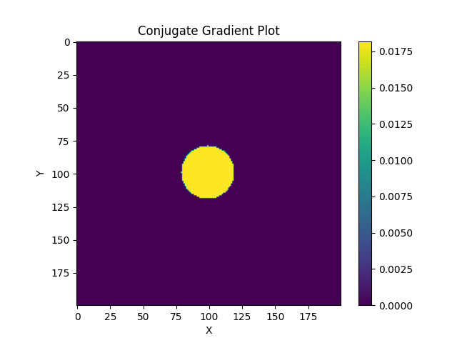
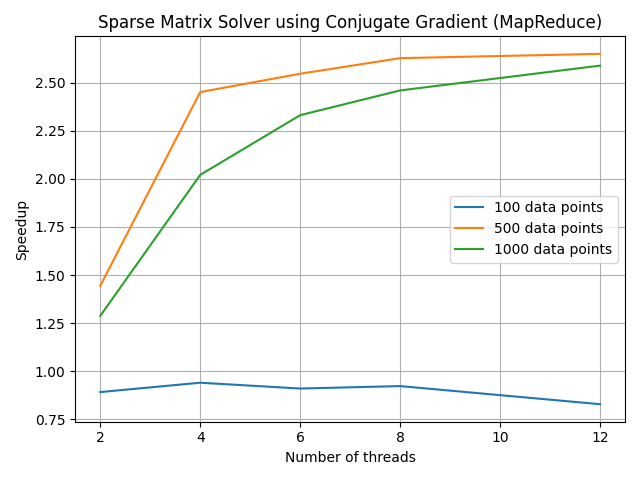

# Project: MapReduce - 

**In the `simulator/simulator.go` file, make sure to change the `benchmarking` flag to `true` when benchmarking and `false` when using application normally.** This flag ensures that no extra print statements are made during benchmarking.

I have implemented the MapReduce feature for different project (not the image editor). This project is the **Sparse Matrix Solver using the Conjugate Gradient method**. All code can be found within the `conjugate_gradient` directory inside the main project directory.

#### Project Description and Motivation - 

This project implements the a parallel conjugate gradient solver applied to the 2D solution of the Poisson equation. The Poisson equation is a partial differential equation that describes the steady state heat distribution in a 2D domain, as well as a range of other phenomenon. This solver takes advantage of the sparse nature of the matrix that results from discretizing the Poisson equation to solve the system of equations in a parallel fashion. The solver is implemented using the conjugate gradient method, which is an iterative method that converges to the solution of the system of equations. This system of equations is often represented in the matrix form as $$Ax = b$$, where `A` is the sparse 2D Poisson matrix, `x` is the solution vector and `b` is the source vector i.e. the constants in each equation of the system. The motivation behind this project is to build a sequential and parallel sparse matrix solver, given that solving systems of equations is a common task in scientific computing and the 2D Poisson equation is so common in naturally occurring phenomenon. 

#### Parallelization using MapReduce - 

The conjugate gradient method is an iterative method that converges to the solution of the system of equations. The algorithm utilizes several dot product operations between vectors, which can be parallelized using the MapReduce paradigm. The MapReduce paradigm is applied to the dot product operations in the following manner -

1. The matrix is split into `n - 1` chunks, where `n` is the number of threads. Each chunk is assigned to a thread.

2. The main thread then spawns `n - 1` threads, each of which is assigned a chunk of the matrix.

3. Each thread then computes the local dot products i.e. the dot products with the chunk assigned it.

4. The main thread also spawns a thread to reduce the result. This reducer thread waits for the `n - 1` threads to finish computing the local dot products and then reduces the results to find the final dot product by summing all local dot products.

5. The main thread then waits for the reducer thread to finish and then returns the final dot product as the global dot product desired in the algorithm.

References to chunks of data and channels are used in order to be space efficient.

This can be seen within the `vector/mapreduce.go` file.

#### Running the Program - 

The data that the program utilizes is `n` which is the size of the source i.e. `b` vector in 1D. Therefore, the size of the computation is over a `n x n` matrix as it is in 2D. The source vector used is that of a sphere for the purposes of animation.

Inputs - 

```
n = size of the source vector in 1D
num_threads = number of threads to be used (in the parallel version)
```

Both the sequential and parallel versions (using MapReduce) have been implemented to gauge the speedup obtained by parallelizing the dot product operations using MapReduce.

Before running any code related to the conjugate gradient project, please ensure that the `simulator/simulator.go` file has the `benchmarking` flag set to `false` as this ensures that no extra print statements are made during benchmarking. When set to `false`, the program runs normally and produces outputs. Set this to `true` when benchmarking.

Additionally, please ensure that you are within the `conjugate_gradient` directory when running the code.

The sequential version can be run using the following command - 

```console
foo@bar:~$ go run simulator/simulator.go <n>
```

The parallel version can be run using the following command - 

```console
foo@bar:~$ go run simulator/simulator.go <n> <num_threads>
```

Another way to run the program is to use the `run_conjugate_gradient.sh` script inside the `conjugate_gradient` directory. This script will first prompt you for an input of `1` or `2`. `1` will run the sequential version and `2` will run the parallel version. The script will then prompt you for the value of `n` and `num_threads` (if you chose to run the parallel version). The script will then run the program with the inputs provided.

This can be done in the following way - 

```console
foo@bar:~$ bash run_conjugate_gradient.sh
```

The outputs will be produced in the `output` directory. This will be a series of text files, each of which contains the solution vector `x` for a particular iteration of the conjugate gradient method. The `output` directory will also contain a `x.txt` file which contains the final solution vector `x` i.e. the solution to the system of equations and a `b.txt` file corresponding to the source vector. **If you run the program using the bash script, the `visualize.py` script will be run automatically after the program has finished running.** To visualize the output as a gif, please run the `visualize.py` script in the `conjugate_gradient` directory. This can be done in the following way - 

```console
foo@bar:~$ python3 visualize.py
```

**Note - To view the gif, please ensure that you have `imageio` and `matplotlib` installed (Both of which can be installed using pip).**

The output gif will be produced in the `output` directory and all text files and temporary image files created to make the gif will be deleted after running the visualize script. The gif labelled `movie.gif`, the final solution vector `x.txt` and the source vector `b.txt` will be retained in the `output` directory. 

**If you run the program using the bash script, the `visualize.py` script will be run automatically after the program has finished running.**

The outputs can be seen below for the input size of `n = 200` - 

Final solution vector `x` - 



The source vector `b` -


The gif showing how the solution vector `x` converges to the source vector `b` -




#### Benchmarking - 

**In the `simulator/simulator.go` file, make sure to change the `benchmarking` flag to `true` when benchmarking and `false` when using application normally.**

**All testing has been carried out on the CS linux cluster i.e. the Peanut Cluster.**

Peanut Cluster specifications - 

```  
1. Core architecture - Intel x86_64

2. Model name - Intel(R) Xeon(R) CPU E5-2420 0 @ 1.90GHz

3. Number of threads - 24

4. Operating system - ubuntu

5. OS version - 20.04.4 LTS

```
The program can be benchmarked using the following command - 

```console
foo@bar:~$ sbatch benchmark_cg.sh
```

This must be run within the `benchmark directory`. Make sure to create the `slurm/out` directory inside `benchmark` directory and check the `.stdout` file for the outputs and the timings. 

The graph of speedups for the MapReduce feature can be seen below - 




The graphs will be created within the `benchmark` directory. The computation of the speedups along with the storing of each of the benchmarking timings and the plotting of the stored data happens by using `benchmark_graph.py` which is called from within `benchmark_cg.sh` (both reside in the `benchmark` directory).


The following observations can be made from the **MapReduce** mode graph where each line signifies a different problem size of `n` - 

1. We see that for `n = 100`, there is no speedup and there is actually a slowdown. This is because, for such a small problem size, the overhead of creating the MapReduce threads and the communication between the threads is more than the time taken to compute the dot product sequentially. This is also the reason why the sequential version is faster than the parallel version for `n = 100`.

2. We see better speedups for `n = 500` and `n = 1000` as we are able to amortize the overhead of creating the MapReduce threads and the communication between the threads due to the larger size of the problem.

3. We see the speedup curves flattening for `n = 500` and `n = 1000` after around 6 threads. This is because we are spawning threads each time we call the dot product function that uses the MapReduce framework. Therefore, as the number of threads used is increased, the number of times we spawn threads in a single run increases as well. This adds to the overall overhead associated with spawning threads and the communication between the threads. 

For more information on the conjugate gradient solver, feel free to refer to [this](https://github.com/DhruvSrikanth/Conjugate-Gradient-Simulation) which contains a detailed explanation of the conjugate gradient method and the sparse matrix solver along with distributed code implemented in `C++`, `OpenMP` and `MPI`.

#### Aknowledgements - 

A big thanks to Professor Lamont Samuels for making the Parallel Programming class so interesting and fun with so many parallel paradigms to learn and projects to practice on. 
